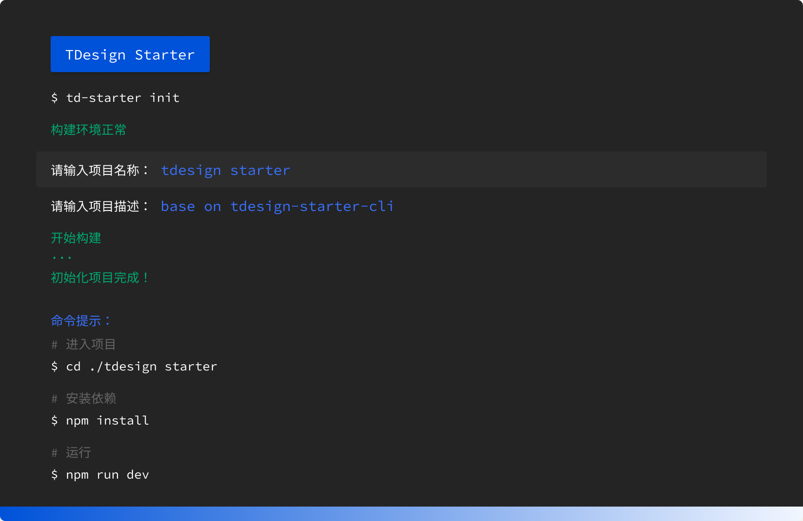
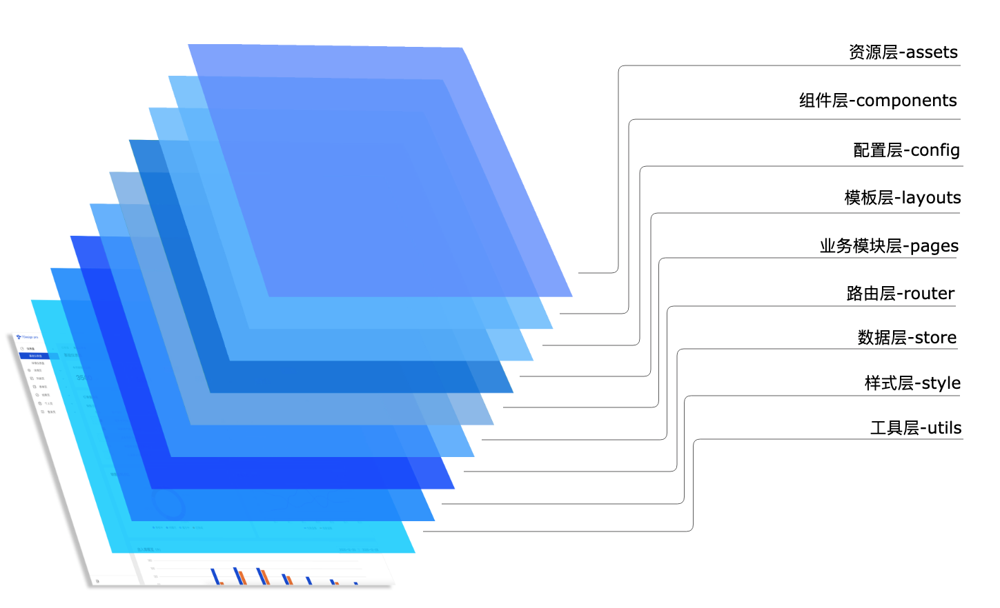

<p align="center">
  <a href="http://tdesgin.tencent.com/starter/vue/#/dashboard/base"></a>
</p>

<p align="center">
  <a href="https://npmjs.com/package/vite"></a>
  <a href="https://nodejs.org/en/about/releases/"></a>
</p>


## 项目简介

`TDesign Starter` 基于 TDesign UI 组件，旨在提供项目开箱即用的、配置式的并且拥有开发体验和设计感的中后台的项目。

## 快速开始

通过 `tdesign-starter-cli `初始化项目仓库

```bash
## 1、安装 tdesign-starter-cli
npm i tdesign-starter-cli@latest -g

## 2、创建项目
td-starter init
```



<br/>

## 项目脚本

```bash
## 安装依赖
npm install

## 使用mock数据 启动项目
npm run dev:mock

## 启动项目
npm run dev

## 项目构建 - 体验环境
npm run build:test

## 项目构建
npm run build

## 项目预览
npm run serve

## 项目lint
npm run lint

## 修复lint
npm run lint:fix

```

## 目录结构


<br/>

```bash
├── PROXY.md
├── README.md                  ## 说明文档
├── cache.dockerfile
├── commitlint.config.js       ## commintlint 规范
├── docker                     ## docker 部署配置文件
├── index.html                 ## 主 html 文件
├── mock                       ## mock 目录
├── package-lock.json
├── package.json
├── public
├── src
│   ├── App.vue
│   ├── assets                 ## 资源层
│   ├── components             ## 组件层
│   ├── config                 ## 配置层
│   ├── layouts                ## 布局层
│   ├── main.jsx               ## 入口逻辑文件
│   ├── pages                  ## 组件层
│   ├── permisson.js          ## 权限页面
│   ├── router                ## 路由层
│   ├── store                 ## vuex 数据层
│   ├── style                 ## 样式目录
│   └── utils                 ## 工具层
└── vite.config.js            ## vite 配置文件
```

## 路由和菜单

菜单（侧边栏和面包屑）由路由配置自动生成，根据路由变化可自动匹配，开发者无需手动处理这些逻辑。
可在<a href="./src/config/routes.js">src/config/routes.js</a>文件中修改。

菜单和路由的映射如下：

```json
{
  "path": "/dashboard",
  "icon": "chart-pie",
  "title": "仪表板",
  "component": "../layouts/default.vue",
  "children": [
    {
      "title": "概览仪表盘",
      "path": "base",
      "component": "../pages/demo.vue",
      "children": [
        {
          "title": "概览仪表盘",
          "path": "base",
          "component": "../pages/demo.vue"
        }
      ]
    }
  ]
}
```

路由使用 `vue-router`

## 布局

网站布局支持“空布局”， “侧边栏导航布局”， “侧边栏布局加头部导航”，“头部导航”四种；布局文件地址在<a href="./src/layouts">src/layouts</a>

更多定制化布局，推荐使用 TDesign UI layout

- `<t-layout>`
- `<t-header>`
- `<t-footer>`
- `<t-aside>`
- `<t-content>`

## 请求数据

### request 采用 axios

`axios` 挂载在 Vue 原型链上， 通过组件实例中通过 `this.$request` 去发起请求。

```javascript
this.$request
  .get('/api/get-list')
  .then((res) => {
    if (res.code === 0) {
    }
  })
  .catch((e) => {
    console.log(e);
  })
  .finally(() => {});
```

### 转发配置 mock

在 vite.config.js 中 viteMockServe 中配置 localEnabled 为 ture 即可开启 mock server 的拦截。

```javascript
viteMockServe({
    mockPath: 'mock',
    localEnabled: true,
}),
```

## 目录命名规范

1.目录名全部使用小写，烧考串形式命名。 2.如果需要有多个单词表达，使用中划线连接。

## 文件命名规范

1.文件名全部使用小写，烧考串形式命名，同时首个单词跟回父目录命名。

2.引导型特殊文件、样式及资源目录文件除外,例如: index.ts, main.ts, index.vue

## 类、接口命名规范

1.类名全部使用大写驼峰，同时命名跟回文件命名

2.接口命名以大写 I 开头，代表 interface

## 分支规范

- 主干分支 -- `develop`
- 功能分支 -- `feature`
- 修复分支 -- `hotfix`

`develop`分支只接受通过 merge request 合入功能分支。
为保证提交的记录干净整洁，其他分支合入之前需要先`rebase` develop 分支。

分支命名规则：`feature/20210401_功能名称`

## 提交规范

整齐美观的提交规范，沟通维护更加省力 [ Angular Git Commit Guidelines](https://zj-git-guide.readthedocs.io/zh_CN/latest/message/Angular%E6%8F%90%E4%BA%A4%E4%BF%A1%E6%81%AF%E8%A7%84%E8%8C%83/)

## 开发联调

前端本地与后台开发联调，详见[文档](./PROXY.md)

## 兼容性

| [](http://godban.github.io/browsers-support-badges/)<br/>IE / Edge | [](http://godban.github.io/browsers-support-badges/)<br/>Firefox | [](http://godban.github.io/browsers-support-badges/)<br/>Chrome | [](http://godban.github.io/browsers-support-badges/)<br/>Safari |
| --------------------------------------------------------------------------------------------------------------------------------------------------------------------------------------------------------------- | ----------------------------------------------------------------------------------------------------------------------------------------------------------------------------------------------------------------- | ------------------------------------------------------------------------------------------------------------------------------------------------------------------------------------------------------------- | ------------------------------------------------------------------------------------------------------------------------------------------------------------------------------------------------------------- |
| Edge >=16                                                                                                                                                                                                       | Firefox >=60                                                                                                                                                                                                      | Chrome >=61                                                                                                                                                                                                   | Safari >=11                                                                                                                                                                                                   |
